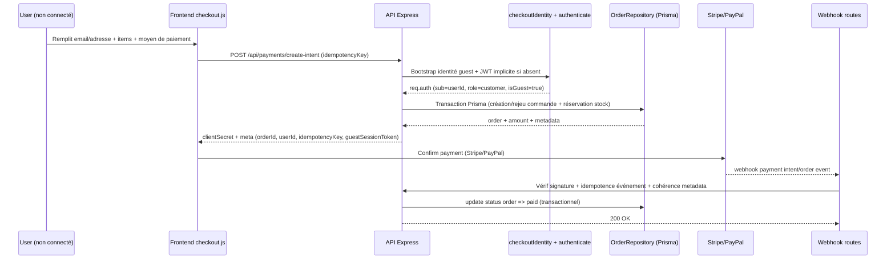

# Guest Checkout – flow complet, sécurité et exploitation

## 1) Flow complet Guest Checkout (diagramme)



## 2) Table `users` modifiée (`isGuest`)

Le modèle Prisma `User` inclut désormais `isGuest` et `guestAddress` pour supporter le checkout invité sans créer immédiatement un compte permanent.

- `isGuest: Boolean @default(false)` permet de distinguer un compte invité d’un compte client classique.
- `guestAddress: Json` permet de conserver l’adresse de checkout guest côté serveur.
- Les index DB incluent `idx_users_is_guest` pour faciliter les requêtes de suivi/migration guest → customer.

Conséquence: le guest reçoit une identité JWT valide côté backend, mais reste borné par les règles RBAC (voir section sécurité).

## 3) Utilisation de l’`idempotencyKey`

L’`idempotencyKey` est obligatoire dans le payload checkout et utilisée pour éviter les doublons de commandes/paiements:

1. Le frontend envoie une clé stable par tentative fonctionnelle (retry réseau inclus).
2. Le backend l’associe à la commande (`orders.idempotency_key` unique).
3. En cas de replay avec même clé:
   - on ne recrée pas de commande;
   - on retourne l’état cohérent déjà persisté.
4. Les webhooks vérifient aussi la cohérence `idempotencyKey` ↔ commande avant transition d’état.

Bénéfices:
- pas de double débit lié aux retries client;
- protection contre doubles écritures applicatives;
- meilleur audit trail (corrélation logs/API/webhooks).

## 4) Webhooks Stripe / PayPal

### Stripe (`POST /api/webhooks/stripe`)
- Vérification de signature (`stripe-signature`) avec secret webhook.
- Validation stricte du payload.
- Idempotence événementielle via stockage `payment_webhook_events.event_id` (unique).
- Vérification de cohérence metadata (`orderId`, `userId`, `idempotencyKey`) avant passage à `paid`.

### PayPal (`POST /api/webhooks/paypal`)
- Validation du payload + métadonnées d’ordre.
- Idempotence sur `eventId` (même stratégie de persistance).
- Refus des mismatches metadata/commande avant update.

## 5) Transactions Prisma pour le stock

La création de commande (et/ou de payment intent) est encapsulée dans une transaction Prisma pour garantir l’atomicité:

- lecture des produits côté DB pour recalcul serveur du total;
- tentative de décrément stock conditionnelle (`stock >= qty`) pour chaque ligne;
- rollback global si un item est insuffisant;
- écriture commande + items + corrélations en une unité transactionnelle.

Résultat: pas de survente même sous concurrence (race conditions), et cohérence forte entre commande et stock.

## 6) Tests runtime nécessaires (minimum recommandé)

À maintenir dans la CI pour sécuriser les régressions:

1. **Auth guest implicite**: création guest + JWT + rôle `customer`.
2. **RBAC checkout**: admin interdit sur endpoints checkout/payment (`403`).
3. **Idempotency orders/payments**: replay même clé ⇒ même résultat métier.
4. **Stock concurrence**: 2 commandes simultanées sur stock limité ⇒ 1 succès, 1 échec contrôlé.
5. **Webhooks Stripe**:
   - signature invalide ⇒ `400`;
   - replay webhook ⇒ pas de double transition.
6. **Webhooks PayPal**:
   - replay event ⇒ idempotent;
   - metadata mismatch ⇒ refus.
7. **Validation stricte payload** (`.strict()`): champs inconnus rejetés.

## 7) Impacts RBAC & sécurité

- Les endpoints checkout/paiement sont **customer-only** (guest inclus car rôle applicatif customer).
- Les admins ne peuvent pas initier de checkout customer.
- La propriété `isGuest` ne doit jamais autoriser d’élévation de privilèges.
- Les contrôles d’ownership reposent sur `req.auth.sub` (jamais sur `userId` fourni client).
- Les montants sont calculés serveur depuis la base produit (pas de confiance au prix frontend).
- Les transitions d’état critiques (paid) passent par webhooks validés + idempotence.

## 8) Recommandations monitoring / logs

### Logs structurés (JSON)
Ajouter/maintenir des logs corrélables avec:
- `requestId`
- `orderId`
- `userId`
- `idempotencyKey`
- `provider` (stripe/paypal)
- `eventId` webhook
- `status` final (accepted/replayed/rejected)
- `reason` (signature_invalid, metadata_mismatch, stock_insufficient, etc.)

### KPIs à monitorer
- taux de `400` checkout (validation/stock)
- taux de `403` checkout (RBAC)
- ratio webhooks rejetés (signature/mismatch)
- taux de replay idempotency (API + webhooks)
- latence p95/p99 `create-intent` et `orders`

### Alerting
- pic anormal de signature webhook invalide
- augmentation brutale des `stock_insufficient`
- divergence intents créés vs commandes `paid`

## 9) Erreurs standardisées (contract API)

Conserver un format homogène de réponse d’erreur (exemple):

```json
{
  "error": {
    "code": "CHECKOUT_STOCK_INSUFFICIENT",
    "message": "Stock insuffisant pour un ou plusieurs articles.",
    "details": [
      { "productId": "...", "requested": 2, "available": 1 }
    ],
    "requestId": "..."
  }
}
```

Codes utiles recommandés:
- `VALIDATION_ERROR` (400)
- `AUTH_UNAUTHORIZED` (401)
- `AUTH_FORBIDDEN` (403)
- `CHECKOUT_STOCK_INSUFFICIENT` (400)
- `PAYMENT_WEBHOOK_SIGNATURE_INVALID` (400)
- `PAYMENT_METADATA_MISMATCH` (400/409)
- `IDEMPOTENCY_CONFLICT` (409 si conflit sémantique)
- `INTERNAL_ERROR` (500)

---

Ce document sert de référence opérationnelle pour maintenir un checkout invité robuste, traçable, et sécurisé en production.